=============
dtype support
=============

The function ``augment_images()``, which all augmenters in ``imgaug`` offer,
works by default with numpy arrays. In most cases, these arrays will have the numpy dtype ``uint8``,
i.e. the images will have values in the range ``[0, 255]``. This is the datatype returned by
most image loading functions. Sometimes however you may want to augment other datatypes,
e.g. ``float64``. While all augmenters support ``uint8``, the support for other datatypes varies.
The tables further below show which datatype is supported by which augmenter (alongside the dtype
support in some helper functions). The API of each augmenter may contain more details.

Note: Whenever possible it is suggested to use ``uint8`` as that is the most thoroughly tested
dtype. In general, the use of large dtypes (i.e. ``uint64``, ``int64``, ``float128``) is
discouraged, even when they are marked as supported. That is because writing correct tests for
these dtypes can be difficult as no larger dtypes are available to which values can be temporarily
cast. Additionally, when using inputs for which precise discrete values are important (e.g.
segmentation maps, where an accidental change by ``1`` would break the map), medium sized dtypes
(``uint32``, ``int32``) should be used with caution. This is because other libraries may convert
temporarily to ``float64``, which could lead to inaccuracies for some numbers.

Legend
------

Support level (color of table cells):

    * Green: Datatype is considered supported by the augmenter.
    * Yellow: Limited support for the datatype, e.g. due to inaccuracies around large values.
      See the API for the respective augmenter for more details.
    * Red: Datatype is not supported by the augmenter.

Test level (symbols in table cells):

    * ``+++``: Datatype support is thoroughly tested (via unittests or integration tests).
    * ``++``: Datatype support is tested, though not thoroughly.
    * ``+``: Datatype support is indirectly tested via tests for other augmenters.
    * ``-``: Datatype support is not tested.
    * ``?``: Unknown support level for the datatype.

imgaug helper functions
-----------------------

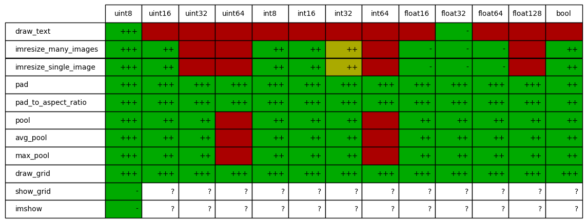

    Dtype support of helper functions in ``imgaug``,
    e.g. ``import imgaug; imgaug.imresize_single_image(array, size)``.

imgaug.augmenters.meta
----------------------

.. figure:: ../images/dtype_support/imgaug_augmenters_meta.png
    :alt: dtype support for augmenters in imgaug.augmenters.meta

    Dtype support for ``augment_images(arrays)``, ``augment_image(arr)`` and
    helper functions in ``imgaug.augmenters.meta``.

imgaug.augmenters.arithmetic
----------------------------

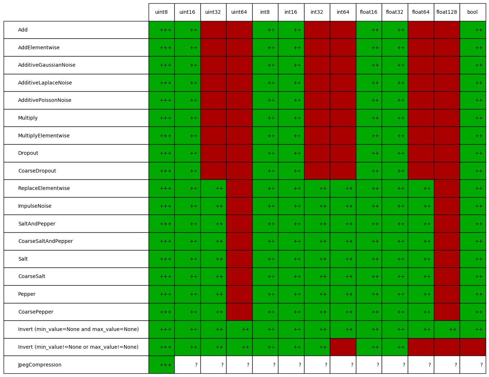

    Dtype support for ``augment_images(arrays)``, ``augment_image(arr)`` and
    helper functions in ``imgaug.augmenters.arithmetic``.

imgaug.augmenters.blend
-----------------------

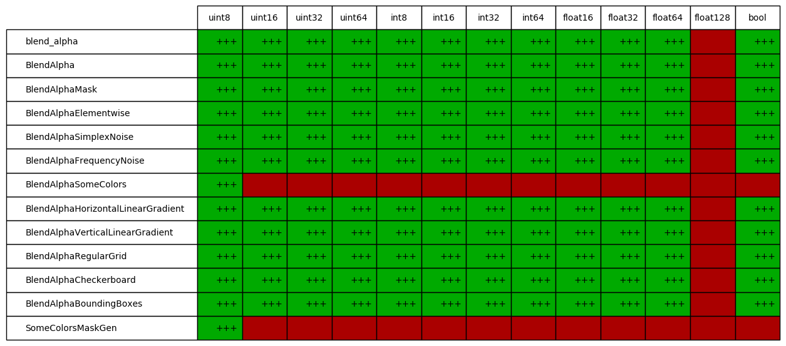

    Dtype support for ``augment_images(arrays)``, ``augment_image(arr)`` and
    helper functions in ``imgaug.augmenters.blend``.

imgaug.augmenters.blur
----------------------

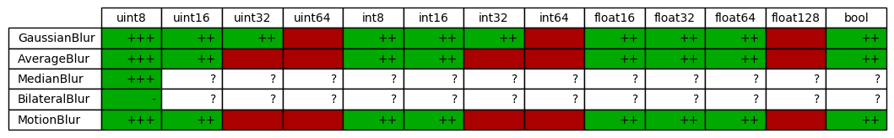

    Dtype support for ``augment_images(arrays)``, ``augment_image(arr)`` and
    helper functions in ``imgaug.augmenters.blur``.

imgaug.augmenters.collections
-----------------------------

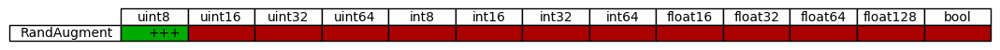

    Dtype support for ``augment_images(arrays)``, ``augment_image(arr)`` and
    helper functions in ``imgaug.augmenters.collections``.

imgaug.augmenters.color
-----------------------

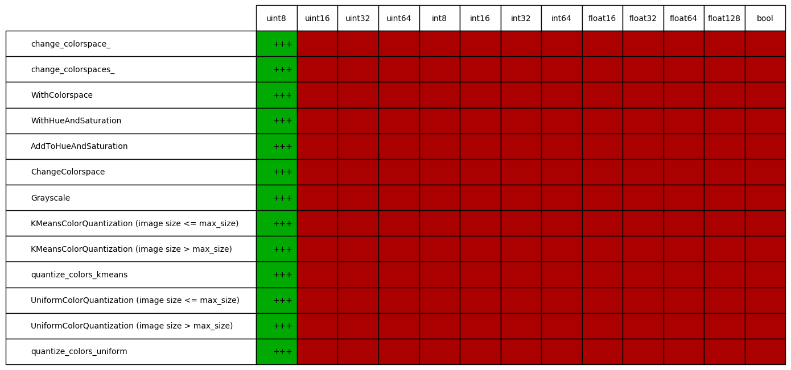

    Dtype support for ``augment_images(arrays)``, ``augment_image(arr)`` and
    helper functions in ``imgaug.augmenters.color``.

imgaug.augmenters.contrast
--------------------------

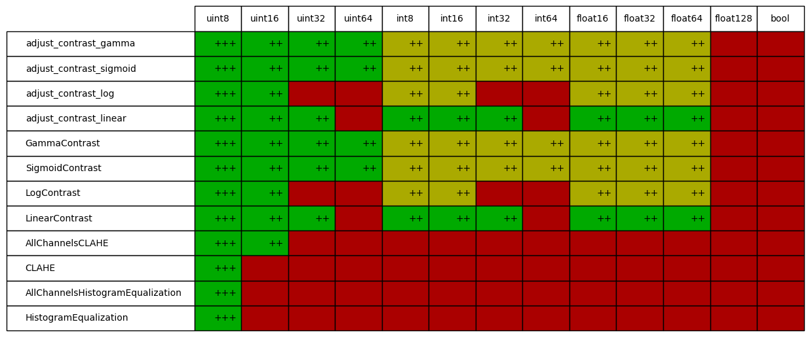

    Dtype support for ``augment_images(arrays)``, ``augment_image(arr)`` and
    helper functions in ``imgaug.augmenters.contrast``.

imgaug.augmenters.convolutional
-------------------------------

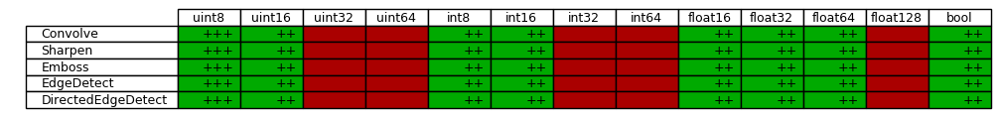

    Dtype support for ``augment_images(arrays)``, ``augment_image(arr)`` and
    helper functions in ``imgaug.augmenters.convolutional``.

imgaug.augmenters.debug
-----------------------

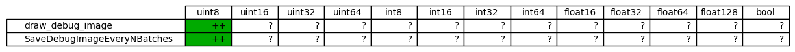

    Dtype support for ``augment_images(arrays)``, ``augment_image(arr)`` and
    helper functions in ``imgaug.augmenters.debug``.

imgaug.augmenters.edges
-----------------------

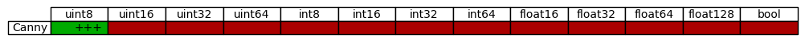

    Dtype support for ``augment_images(arrays)``, ``augment_image(arr)`` and
    helper functions in ``imgaug.augmenters.edges``.

imgaug.augmenters.flip
----------------------

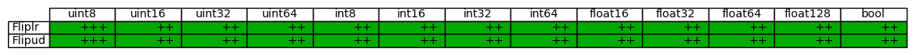

    Dtype support for ``augment_images(arrays)``, ``augment_image(arr)`` and
    helper functions in ``imgaug.augmenters.flip``.

imgaug.augmenters.geometric
---------------------------

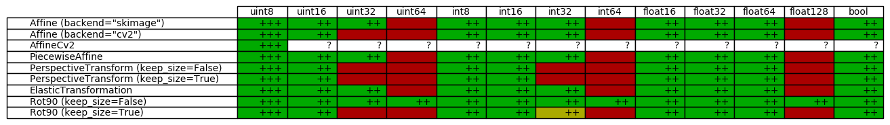

    Dtype support for ``augment_images(arrays)``, ``augment_image(arr)`` and
    helper functions in ``imgaug.augmenters.geometric``.

imgaug.augmenters.imgcorruptlike
--------------------------------

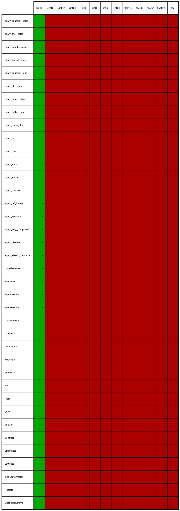

    Dtype support for ``augment_images(arrays)``, ``augment_image(arr)`` and
    helper functions in ``imgaug.augmenters.imgcorruptlike``.

imgaug.augmenters.pillike
-------------------------

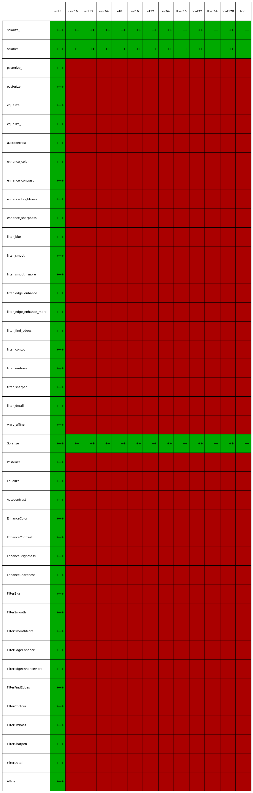

    Dtype support for ``augment_images(arrays)``, ``augment_image(arr)`` and
    helper functions in ``imgaug.augmenters.pillike``.

imgaug.augmenters.segmentation
------------------------------

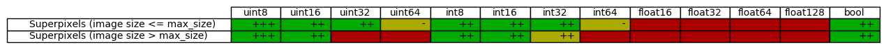

    Dtype support for ``augment_images(arrays)``, ``augment_image(arr)`` and
    helper functions in ``imgaug.augmenters.segmentation``.

imgaug.augmenters.size
----------------------

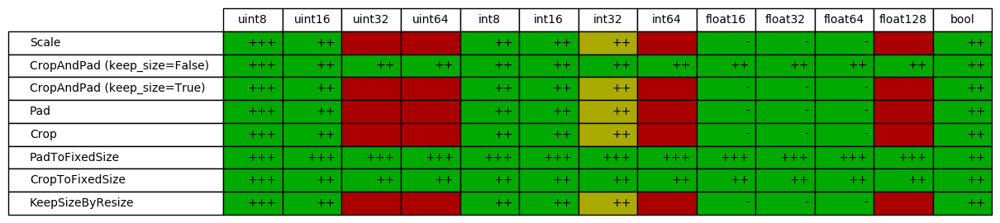

    Dtype support for ``augment_images(arrays)``, ``augment_image(arr)`` and
    helper functions in ``imgaug.augmenters.size``.

imgaug.augmenters.weather
-------------------------

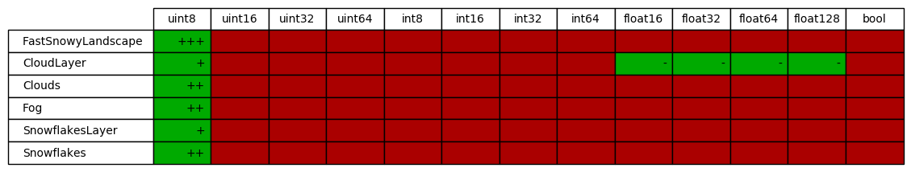

    Dtype support for ``augment_images(arrays)``, ``augment_image(arr)`` and
    helper functions in ``imgaug.augmenters.weather``.