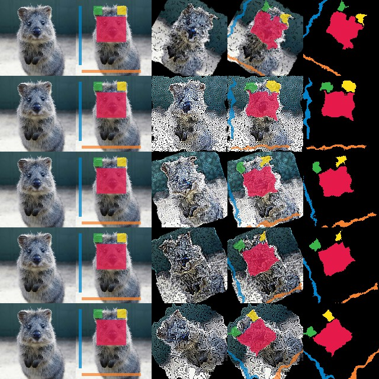
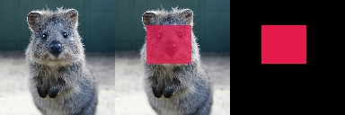
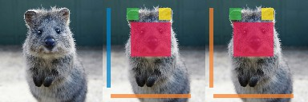

=====================================
Examples: Segmentation Maps and Masks
=====================================

``imgaug`` offers support for segmentation map data, such as semantic
segmentation maps, instance segmentation maps or ordinary masks. Segmentation
maps can be augmented correspondingly to images. E.g. if an image is rotated
by 45°, the corresponding segmentation map for that image will also be rotated
by 45°.

**Note**: All augmentation functions for segmentation maps are implemented
under the assumption of augmenting **ground truth** data. As such,
segmentation maps will be affected by augmentations that change the geometry
of images (e.g. affine transformations, cropping, resizing), but not by other
augmentations (e.g. gaussian noise, saturation changes, grayscaling,
dropout, ...).

Features of the library's segmentation map support:

    * Represent segmentation maps as objects
      (``imgaug.augmentables.segmaps.SegmentationMapsOnImage``).
    * Support integer maps (integer dtypes, usually ``int32``) and boolean
      masks (dtype ``numpy.bool_``).
    * Augment segmentation maps (only geometry-affecting augmentations,
      e.g. affine transformations, cropping, ...).
    * Use different resolutions for segmentation maps and images (e.g.
      ``32x32`` segmentation maps and ``256x256`` for the corresponding
      images).
    * Draw segmentation maps -- on their own or on images
      (``SegmentationMapsOnImage.draw()``,
      ``SegmentationMapsOnImage.draw_on_image()``).
    * Resize segmentation maps (``SegmentationMapsOnImage.resize()``).
    * Pad segmentation maps by pixel amounts or to desired aspect ratios
      (``SegmentationMapsOnImage.pad()``,
      ``SegmentationMapsOnImage.pad_to_aspect_ratio()``).

Notebook
--------

A jupyter notebook for segmentation map augmentation is available at
:ref:`page_jupyter_notebooks`. The notebooks are usually more up to date
and contain more examples than the ReadTheDocs documentation.

A simple example
----------------

The following example loads a standard image and defines a corresponding
``int32`` segmentation map. The image and segmentation map are augmented in the
same way and the results are visualized.

::

    import imageio
    import numpy as np
    import imgaug as ia
    import imgaug.augmenters as iaa
    from imgaug.augmentables.segmaps import SegmentationMapsOnImage

    ia.seed(1)

    # Load an example image (uint8, 128x128x3).
    image = ia.quokka(size=(128, 128), extract="square")

    # Define an example segmentation map (int32, 128x128).
    # Here, we arbitrarily place some squares on the image.
    # Class 0 is our intended background class.
    segmap = np.zeros((128, 128, 1), dtype=np.int32)
    segmap[28:71, 35:85, 0] = 1
    segmap[10:25, 30:45, 0] = 2
    segmap[10:25, 70:85, 0] = 3
    segmap[10:110, 5:10, 0] = 4
    segmap[118:123, 10:110, 0] = 5
    segmap = SegmentationMapsOnImage(segmap, shape=image.shape)

    # Define our augmentation pipeline.
    seq = iaa.Sequential([
        iaa.Dropout([0.05, 0.2]),      # drop 5% or 20% of all pixels
        iaa.Sharpen((0.0, 1.0)),       # sharpen the image
        iaa.Affine(rotate=(-45, 45)),  # rotate by -45 to 45 degrees (affects segmaps)
        iaa.ElasticTransformation(alpha=50, sigma=5)  # apply water effect (affects segmaps)
    ], random_order=True)

    # Augment images and segmaps.
    images_aug = []
    segmaps_aug = []
    for _ in range(5):
        images_aug_i, segmaps_aug_i = seq(image=image, segmentation_maps=segmap)
        images_aug.append(images_aug_i)
        segmaps_aug.append(segmaps_aug_i)

    # We want to generate an image containing the original input image and
    # segmentation maps before/after augmentation. (Both multiple times for
    # multiple augmentations.)
    #
    # The whole image is supposed to have five columns:
    # (1) original image,
    # (2) original image with segmap,
    # (3) augmented image,
    # (4) augmented segmap on augmented image,
    # (5) augmented segmap on its own in.
    #
    # We now generate the cells of these columns.
    #
    # Note that draw_on_image() and draw() both return lists of drawn
    # images. Assuming that the segmentation map array has shape (H,W,C),
    # the list contains C items.
    cells = []
    for image_aug, segmap_aug in zip(images_aug, segmaps_aug):
        cells.append(image)                                         # column 1
        cells.append(segmap.draw_on_image(image)[0])                # column 2
        cells.append(image_aug)                                     # column 3
        cells.append(segmap_aug.draw_on_image(image_aug)[0])        # column 4
        cells.append(segmap_aug.draw(size=image_aug.shape[:2])[0])  # column 5

    # Convert cells to a grid image and save.
    grid_image = ia.draw_grid(cells, cols=5)
    imageio.imwrite("example_segmaps.jpg", grid_image)

    Results of the above example code. Columns show: (1) Original image,
    (2) original segmentation map drawn on original image, (3) augmented
    image, (4) augmented segmentation map drawn on augmented image,
    (5) augmented segmentation map drawn on its own.

Using boolean masks
-------------------

In order to augment masks, you can simply use boolean arrays. Everything else
is identical to ``int32`` maps. The below code shows an example and is very
similar to the previous code for ``int32`` maps. It noteably changes
``np.zeros((128, 128, 1), dtype=np.int32)`` to
``np.zeros((128, 128, 1), dtype=bool)``.

::

    import imageio
    import numpy as np
    import imgaug as ia
    from imgaug.augmentables.segmaps import SegmentationMapsOnImage

    # Load an example image (uint8, 128x128x3).
    image = ia.quokka(size=(128, 128), extract="square")

    # Create an example mask (bool, 128x128).
    # Here, we arbitrarily place a square on the image.
    segmap = np.zeros((128, 128, 1), dtype=bool)
    segmap[28:71, 35:85, 0] = True
    segmap = SegmentationMapsOnImage(segmap, shape=image.shape)

    # Draw three columns: (1) original image,
    # (2) original image with mask on top, (3) only mask
    cells = [
        image,
        segmap.draw_on_image(image)[0],
        segmap.draw(size=image.shape[:2])[0]
    ]

    # Convert cells to a grid image and save.
    grid_image = ia.draw_grid(cells, cols=3)
    imageio.imwrite("example_segmaps_bool.jpg", grid_image)

    Results of the above example code. Columns show: (1) Original image,
    (2) boolean segmentation map (i.e. mask) drawn on image, (3) boolean
    segmentation map drawn on its own.

Accessing the segmentation map array
------------------------------------

After augmentation it is often desired to re-access the segmentation map
array. This can be done using ``SegmentationMapsOnImage.get_arr()``,
which returns a segmentation map array with the same shape and dtype as
was originally provided as ``arr`` to ``SegmentationMapsOnImage(arr, ...)``.

The below code shows an example that accesses and changes the array.

::

    import imageio
    import numpy as np
    import imgaug as ia
    from imgaug.augmentables.segmaps import SegmentationMapsOnImage

    # Load an example image (uint8, 128x128x3).
    image = ia.quokka(size=(128, 128), extract="square")

    # Create an example segmentation map (int32, 128x128).
    # Here, we arbitrarily place some squares on the image.
    # Class 0 is the background class.
    segmap = np.zeros((128, 128, 1), dtype=np.int32)
    segmap[28:71, 35:85, 0] = 1
    segmap[10:25, 30:45, 0] = 2
    segmap[10:25, 70:85, 0] = 3
    segmap[10:110, 5:10, 0] = 4
    segmap[118:123, 10:110, 0] = 5
    segmap1 = SegmentationMapsOnImage(segmap, shape=image.shape)

    # Read out the segmentation map's array, change it and create a new
    # segmentation map
    arr = segmap1.get_arr()
    arr[10:110, 5:10, 0] = 5
    segmap2 = ia.SegmentationMapsOnImage(arr, shape=image.shape)

    # Draw three columns: (1) original image, (2) original image with
    # unaltered segmentation map on top, (3) original image with altered
    # segmentation map on top
    cells = [
        image,
        segmap1.draw_on_image(image)[0],
        segmap2.draw_on_image(image)[0]
    ]

    # Convert cells to grid image and save.
    grid_image = ia.draw_grid(cells, cols=3)
    imageio.imwrite("example_segmaps_array.jpg", grid_image)

    Results of the above example code. Columns show: (1) Original image,
    (2) original segmentation map drawn on original image, (3) segmentation
    map with modified array drawn on image.

Resizing and padding
--------------------

Segmentation maps can easily be resized and padded. The methods are identical
to the ones used for heatmaps (see :doc:``examples_heatmaps``), though
segmentation maps do not offer resizing via average or max pooling. The
``resize()`` method also defaults to nearest neighbour interpolation (instead
of ``cubic`` interpolation) and it is recommended to not change that.

The functions for resizing and padding are:

  * ``SegmentationMapsOnImage.resize(sizes, interpolation="nearest")``:
    Resizes to ``sizes`` given as a tuple ``(height, width)``. Interpolation
    can be ``nearest``, ``linear``, ``cubic`` and ``area``, but only
    ``nearest`` is actually recommended.
  * ``SegmentationMapsOnImage.pad(top=0, right=0, bottom=0, left=0, mode="constant", cval=0)``:
    Pads the segmentation map by given pixel amounts. Uses by default constant
    value padding with value ``0``, i.e. zero-padding. Possible padding modes
    are the same as for ``numpy.pad()``, i.e. ``constant``, ``edge``,
    ``linear_ramp``, ``maximum``, ``mean``, ``median``, ``minimum``,
    ``reflect``, ``symmetric`` and ``wrap``.
  * ``SegmentationMapsOnImage.pad_to_aspect_ratio(aspect_ratio, mode="constant", cval=0, return_pad_amounts=False)``:
    Same as ``pad()``, but pads an image towards a desired aspect ratio
    (``ratio = width / height``). E.g. use ``1.0`` for squared segmentation
    maps or ``2.0`` for maps that are twice as wide as they are high.
