****************
augmenters.blend
****************

.. note::

    It is not recommended to use blending augmenter with child augmenters
    that change the geometry of images (e.g. horizontal flips, affine
    transformations) if you *also* want to augment coordinates (e.g.
    keypoints, bounding boxes, polygons, ...), as it is not clear which of
    the two coordinate results (first or second branch) should be used as the
    coordinates after augmentation. Currently, all blending augmenters try
    to use the augmented coordinates of the branch that makes up most of the
    augmented image.

Alpha
-----

Alpha-blend two image sources using an alpha/opacity value.

Currently, if ``factor >= 0.5`` (per image), the results of the first
branch are used as the new coordinates, otherwise the results of the
second branch.

API link: :class:`~imgaug.augmenters.blend.Alpha`

**Example.**
Convert each image to pure grayscale and alpha-blend the result with the
original image using an alpha of ``50%``, thereby removing about ``50%`` of
all color. This is equivalent to ``iaa.Grayscale(0.5)``. ::

    import imgaug.augmenters as iaa
    aug = iaa.Alpha(0.5, iaa.Grayscale(1.0))

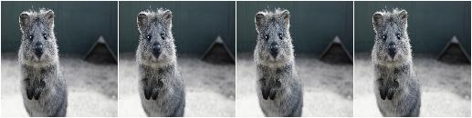

**Example.**
Same as in the previous example, but the alpha factor is sampled uniformly
from the interval ``[0.0, 1.0]`` once per image, thereby removing a random
fraction of all colors. This is equivalent to
``iaa.Grayscale((0.0, 1.0))``. ::

    aug = iaa.Alpha((0.0, 1.0), iaa.Grayscale(1.0))

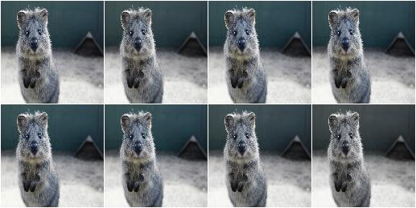

**Example.**
First, rotate each image by a random degree sampled uniformly from the
interval ``[-20, 20]``. Then, alpha-blend that new image with the original
one using a random factor sampled uniformly from the interval
``[0.0, 1.0]``. For ``50%`` of all images, the blending happens
channel-wise and the factor is sampled independently per channel
(``per_channel=0.5``). As a result, e.g. the red channel may look visibly
rotated (factor near ``1.0``), while the green and blue channels may not
look rotated (factors near ``0.0``). ::

    aug = iaa.Alpha(
        (0.0, 1.0),
        iaa.Affine(rotate=(-20, 20)),
        per_channel=0.5)

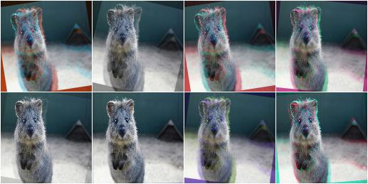

**Example.**
Apply two branches of augmenters -- ``A`` and ``B`` -- *independently*
to input images and alpha-blend the results of these branches using a
factor ``f``. Branch ``A`` increases image pixel intensities by ``100``
and ``B`` multiplies the pixel intensities by ``0.2``. ``f`` is sampled
uniformly from the interval ``[0.0, 1.0]`` per image. The resulting images
contain a bit of ``A`` and a bit of ``B``. ::

    aug = iaa.Alpha(
        (0.0, 1.0),
        first=iaa.Add(100),
        second=iaa.Multiply(0.2))

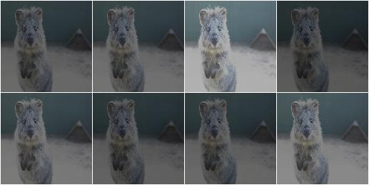

**Example.**
Apply median blur to each image and alpha-blend the result with the original
image using an alpha factor of either exactly ``0.25`` or exactly ``0.75``
(sampled once per image). ::

    aug = iaa.Alpha([0.25, 0.75], iaa.MedianBlur(13))

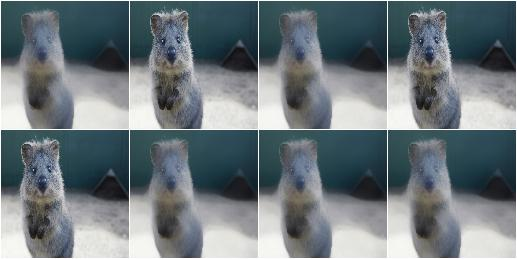

AlphaElementwise
----------------

Alpha-blend two image sources using alpha/opacity values sampled per pixel.

This is the same as ``Alpha``, except that the opacity factor is
sampled once per *pixel* instead of once per *image* (or a few times per
image, if ``Alpha.per_channel`` is set to ``True``).

Currently, if ``factor >= 0.5`` (per pixel), the results of the first
branch are used as the new coordinates, otherwise the results of the
second branch.

API link: :class:`~imgaug.augmenters.blend.AlphaElementwise`

**Example.**
Convert each image to pure grayscale and alpha-blend the result with the
original image using an alpha of ``50%`` for all pixels, thereby removing
about ``50%`` of all color. This is equivalent to ``iaa.Grayscale(0.5)``.
This is also equivalent to ``iaa.Alpha(0.5, iaa.Grayscale(1.0))``, as
the opacity has a fixed value of ``0.5`` and is hence identical for all
pixels. ::

    import imgaug.augmenters as iaa
    aug = iaa.AlphaElementwise(0.5, iaa.Grayscale(1.0))

.. figure:: ../../images/overview_of_augmenters/blend/alphaelementwise_050_grayscale.jpg
    :alt: Alpha-blend images pixelwise with grayscale images

**Example.**
Same as in the previous example, but the alpha factor is sampled uniformly
from the interval ``[0.0, 1.0]`` once per pixel, thereby removing a random
fraction of all colors from each pixel. This is equivalent to
``iaa.Grayscale((0.0, 1.0))``. ::

    aug = iaa.AlphaElementwise((0, 1.0), iaa.Grayscale(1.0))

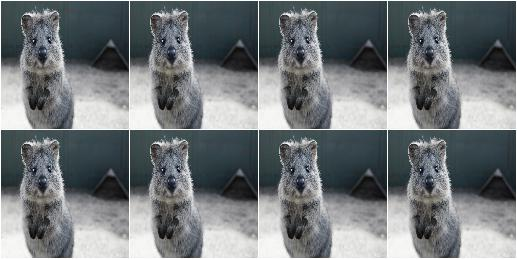

**Example.**
First, rotate each image by a random degree sampled uniformly from the
interval ``[-20, 20]``. Then, alpha-blend that new image with the original
one using a random factor sampled uniformly from the interval
``[0.0, 1.0]`` per pixel. For ``50%`` of all images, the blending happens
channel-wise and the factor is sampled independently per pixel *and*
channel (``per_channel=0.5``). As a result, e.g. the red channel may look
visibly rotated (factor near ``1.0``), while the green and blue channels
may not look rotated (factors near ``0.0``). ::

    aug = iaa.AlphaElementwise(
        (0.0, 1.0),
        iaa.Affine(rotate=(-20, 20)),
        per_channel=0.5)

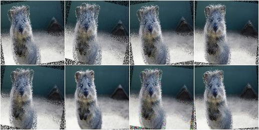

**Example.**
Apply two branches of augmenters -- ``A`` and ``B`` -- *independently*
to input images and alpha-blend the results of these branches using a
factor ``f``. Branch ``A`` increases image pixel intensities by ``100``
and ``B`` multiplies the pixel intensities by ``0.2``. ``f`` is sampled
uniformly from the interval ``[0.0, 1.0]`` per pixel. The resulting images
contain a bit of ``A`` and a bit of ``B``. ::

    aug = iaa.AlphaElementwise(
        (0.0, 1.0),
        first=iaa.Add(100),
        second=iaa.Multiply(0.2))

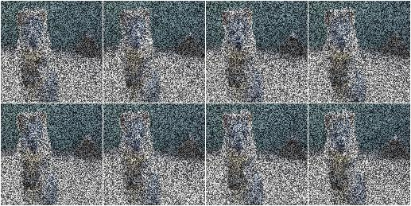

**Example.**
Apply median blur to each image and alpha-blend the result with the
original image using an alpha factor of either exactly ``0.25`` or
exactly ``0.75`` (sampled once per pixel). ::

    aug = iaa.AlphaElementwise([0.25, 0.75], iaa.MedianBlur(13))

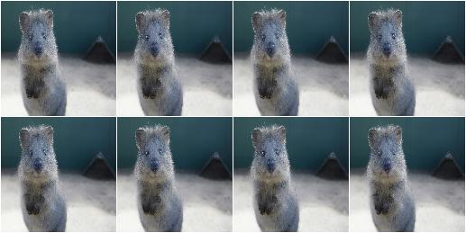

SimplexNoiseAlpha
-----------------

Alpha-blend two image sources using simplex noise alpha masks.

The alpha masks are sampled using a simplex noise method, roughly creating
connected blobs of 1s surrounded by 0s. If nearest neighbour
upsampling is used, these blobs can be rectangular with sharp edges.

API link: :class:`~imgaug.augmenters.blend.SimplexNoiseAlpha`

**Example.**
Detect per image all edges, mark them in a black and white image and
then alpha-blend the result with the original image using simplex noise
masks. ::

    import imgaug.augmenters as iaa
    aug = iaa.SimplexNoiseAlpha(iaa.EdgeDetect(1.0))

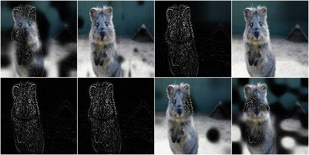

**Example.**
Same as in the previous example, but using only nearest neighbour
upscaling to scale the simplex noise masks to the final image sizes, i.e.
no nearest linear upsampling is used. This leads to rectangles with sharp
edges. ::

    aug = iaa.SimplexNoiseAlpha(
        iaa.EdgeDetect(1.0),
        upscale_method="nearest")

.. figure:: ../../images/overview_of_augmenters/blend/simplexnoisealpha_nearest.jpg
    :alt: SimplexNoiseAlpha with EdgeDetect and nearest neighbour upscaling

**Example.**
Same as in the previous example, but using only linear upscaling to
scale the simplex noise masks to the final image sizes, i.e. no nearest
neighbour upsampling is used. This leads to rectangles with smooth edges. ::

    aug = iaa.SimplexNoiseAlpha(
        iaa.EdgeDetect(1.0),
        upscale_method="linear")

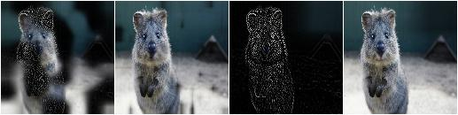

**Example.**
Same as in the first example, but using a threshold for the sigmoid
function that is further to the right. This is more conservative, i.e.
the generated noise masks will be mostly black (values around ``0.0``),
which means that most of the original images (parameter/branch `second`)
will be kept, rather than using the results of the augmentation
(parameter/branch `first`). ::

    import imgaug.parameters as iap
    aug = iaa.SimplexNoiseAlpha(
        iaa.EdgeDetect(1.0),
        sigmoid_thresh=iap.Normal(10.0, 5.0))

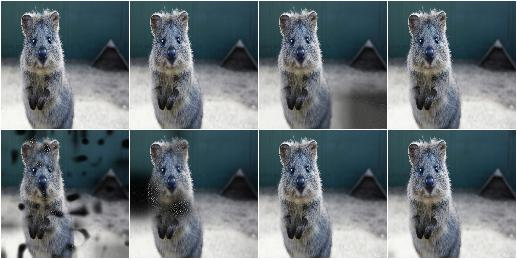

FrequencyNoiseAlpha
-------------------

Alpha-blend two image sources using frequency noise masks.

The alpha masks are sampled using frequency noise of varying scales,
which can sometimes create large connected blobs of 1s surrounded by 0s
and other times results in smaller patterns. If nearest neighbour
upsampling is used, these blobs can be rectangular with sharp edges.

API link: :class:`~imgaug.augmenters.blend.FrequencyNoiseAlpha`

**Example.**
Detect per image all edges, mark them in a black and white image and
then alpha-blend the result with the original image using frequency noise
masks. ::

    import imgaug.augmenters as iaa
    aug = iaa.FrequencyNoiseAlpha(first=iaa.EdgeDetect(1.0))

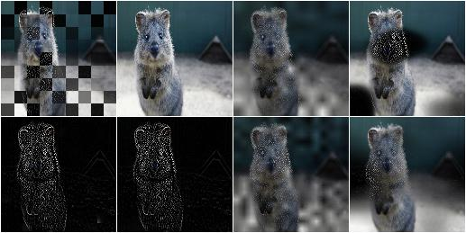

**Example.**
Same as the first example, but using only linear upscaling to
scale the frequency noise masks to the final image sizes, i.e. no nearest
neighbour upsampling is used. This results in smooth edges. ::

    aug = iaa.FrequencyNoiseAlpha(
        first=iaa.EdgeDetect(1.0),
        upscale_method="nearest")

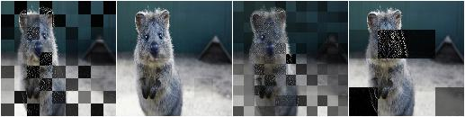

**Example.**
Same as the first example, but using only linear upscaling to
scale the frequency noise masks to the final image sizes, i.e. no nearest
neighbour upsampling is used. This results in smooth edges. ::

    aug = iaa.FrequencyNoiseAlpha(
        first=iaa.EdgeDetect(1.0),
        upscale_method="linear")

.. figure:: ../../images/overview_of_augmenters/blend/frequencynoisealpha_linear.jpg
    :alt: FrequencyNoiseAlpha with EdgeDetect and linear upscaling

**Example.**
Same as in the previous example, but with the exponent set to a constant
``-2`` and the sigmoid deactivated, resulting in cloud-like patterns
without sharp edges. ::

    aug = iaa.FrequencyNoiseAlpha(
        first=iaa.EdgeDetect(1.0),
        upscale_method="linear",
        exponent=-2,
        sigmoid=False)

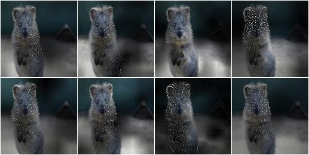

**Example.**
Same as the first example, but using a threshold for the sigmoid function
that is further to the right. This is more conservative, i.e. the generated
noise masks will be mostly black (values around ``0.0``), which means that
most of the original images (parameter/branch `second`) will be kept,
rather than using the results of the augmentation (parameter/branch
`first`). ::

    import imgaug.parameters as iap
    aug = iaa.FrequencyNoiseAlpha(
        first=iaa.EdgeDetect(1.0),
        sigmoid_thresh=iap.Normal(10.0, 5.0))

.. figure:: ../../images/overview_of_augmenters/blend/frequencynoisealpha_sigmoid_thresh_normal.jpg
    :alt: FrequencyNoiseAlpha with EdgeDetect and gaussian-distributed sigmoid threshold